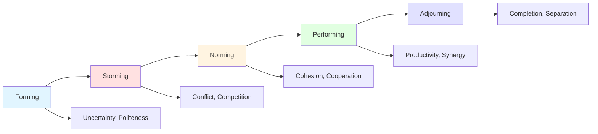
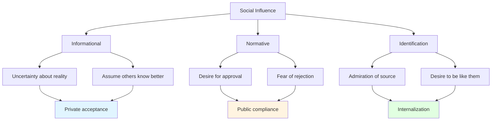
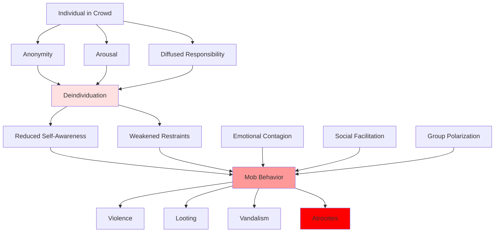
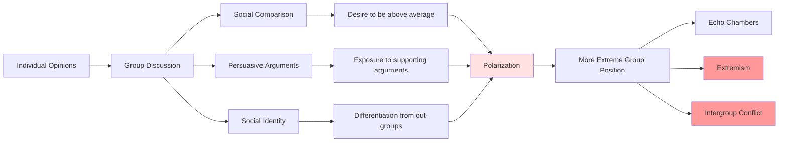

# Group Dynamics: The Emergent Properties of Collective Behavior

## Overview

Group dynamics refers to the patterns of interaction, influence, and behavior that emerge when individuals come together. A fundamental insight of sociology is that **groups are not simply collections of individuals**—they have emergent properties that cannot be predicted from individual characteristics alone. A crowd has its own psychology; a committee makes decisions differently than individuals; a mob behaves in ways its members would never act alone.

Understanding group dynamics is essential to understanding humanity's problems because most consequential human behavior occurs in group contexts. Wars are fought by groups, not individuals. Markets are collective phenomena. Political movements are group dynamics. Even individual behavior is shaped by group membership and social influence.

**The core problem**: Group dynamics can amplify both the best and worst of human nature. Groups enable cooperation, creativity, and collective achievement impossible for individuals. But groups also produce conformity, groupthink, mob violence, and collective delusions. The same mechanisms that enable human civilization also enable its worst atrocities.

## Table of Contents

- [Fundamental Group Processes](#fundamental-group-processes)
- [Conformity and Social Influence](#conformity-and-social-influence)
- [Groupthink and Decision-Making](#groupthink-and-decision-making)
- [Deindividuation and Mob Behavior](#deindividuation-and-mob-behavior)
- [Leadership and Authority](#leadership-and-authority)
- [Group Polarization](#group-polarization)
- [Historical Examples](#historical-examples)
- [Contemporary Manifestations](#contemporary-manifestations)
- [Future Implications](#future-implications)
- [Interconnections](#interconnections)

## Fundamental Group Processes

### Group Formation and Development

**Diagram Explanation**: Tuckman's model shows groups progress through predictable stages. Forming involves uncertainty as members get acquainted. Storming brings conflict as members compete for roles and influence. Norming establishes cohesion as norms and roles solidify. Performing achieves productivity through established cooperation. Adjourning involves completion and separation. Understanding these stages reveals why groups often struggle initially and why disrupting established groups can be costly.

### Social Roles and Norms

| Element | Description | Function | Problems |
|---------|-------------|----------|----------|
| **Roles** | Expected behaviors for positions | Coordinate behavior, reduce uncertainty | Role conflict, role strain, rigidity |
| **Norms** | Shared rules and expectations | Enable cooperation, maintain order | Conformity pressure, resistance to change |
| **Status** | Relative position in hierarchy | Motivate contribution, organize influence | Inequality, status anxiety, competition |
| **Cohesion** | Bonds between members | Increase commitment, cooperation | Groupthink, exclusion of outsiders |

**Table Explanation**: Groups develop structures that coordinate behavior and enable cooperation. Roles specify expected behaviors, reducing uncertainty but creating potential conflicts. Norms establish shared rules that maintain order but enforce conformity. Status hierarchies motivate contribution but create inequality. Cohesion increases commitment but can produce groupthink. Each element serves important functions while creating characteristic problems.

## Conformity and Social Influence

### The Asch Conformity Experiments

Solomon Asch's classic experiments revealed the power of social influence:

**Setup**: Participants judged which of three lines matched a reference line—an objectively easy task.

**Manipulation**: Confederate actors gave obviously wrong answers.

**Results**: 
- 75% of participants conformed at least once
- 37% of responses were conformist
- Participants conformed even when certain they were right

**Implications**: Humans will deny the evidence of their own senses to conform to group consensus.

### Types of Social Influence

**Diagram Explanation**: Social influence operates through three mechanisms. Informational influence occurs when uncertainty leads people to assume others know better, producing genuine private acceptance of group views. Normative influence stems from desire for approval and fear of rejection, producing public compliance without private acceptance. Identification influence comes from admiration and desire to emulate, producing internalization of group values. Understanding these mechanisms reveals why people conform in different ways and contexts.

### The Milgram Obedience Studies

Stanley Milgram's experiments demonstrated shocking obedience to authority:

**Setup**: Participants instructed to administer electric shocks to learners (actually actors) for wrong answers.

**Results**:
- 65% administered maximum 450-volt shock
- Participants continued despite learner's screams and pleas
- Obedience occurred even when participants were distressed

**Factors Increasing Obedience**:
- Proximity to authority figure
- Prestige of institution
- Gradual escalation
- Diffusion of responsibility
- Lack of dissenting models

**Implications**: Ordinary people will commit harmful acts when directed by authority, explaining how atrocities occur.

## Groupthink and Decision-Making

### The Groupthink Phenomenon

Irving Janis identified groupthink as a mode of thinking in cohesive groups where desire for unanimity overrides realistic appraisal:

**Symptoms**:
1. **Illusion of invulnerability**: Excessive optimism, risk-taking
2. **Collective rationalization**: Discounting warnings
3. **Belief in inherent morality**: Ignoring ethical consequences
4. **Stereotyping out-groups**: Viewing opponents as weak or evil
5. **Direct pressure on dissenters**: Suppressing disagreement
6. **Self-censorship**: Members withhold doubts
7. **Illusion of unanimity**: Silence interpreted as agreement
8. **Self-appointed mindguards**: Members protect group from dissent

**Consequences**:
- Incomplete survey of alternatives
- Incomplete survey of objectives
- Failure to examine risks
- Failure to reappraise initially rejected alternatives
- Poor information search
- Selective bias in processing information
- Failure to develop contingency plans

### Historical Groupthink Disasters

| Event | Year | Groupthink Symptoms | Outcome |
|-------|------|---------------------|---------|
| **Bay of Pigs Invasion** | 1961 | Illusion of invulnerability, stereotyping, self-censorship | Catastrophic failure, international embarrassment |
| **Pearl Harbor** | 1941 | Rationalization, failure to process warnings | Devastating surprise attack |
| **Challenger Disaster** | 1986 | Pressure on dissenters, illusion of unanimity | Seven deaths, program setback |
| **Iraq War** | 2003 | Stereotyping, selective information processing | Prolonged conflict, massive costs |
| **Financial Crisis** | 2008 | Illusion of invulnerability, rationalization | Global economic collapse |

**Table Explanation**: Major historical disasters demonstrate groupthink's catastrophic potential. In each case, intelligent, well-intentioned groups made disastrous decisions because cohesion and conformity pressure prevented critical evaluation. The pattern repeats: overconfidence, dismissal of warnings, suppression of dissent, and catastrophic outcomes.

## Deindividuation and Mob Behavior

### The Loss of Individual Identity

Deindividuation occurs when group membership reduces self-awareness and personal accountability:

**Factors Promoting Deindividuation**:
- Anonymity (masks, uniforms, crowds)
- Arousal and sensory overload
- Diffused responsibility
- Group size
- Novel or unstructured situations

**Consequences**:
- Reduced self-monitoring
- Weakened restraints against impulsive behavior
- Increased responsiveness to immediate cues
- Reduced concern for social evaluation
- Behavior becomes more extreme

### Mob Violence and Collective Behavior

**Diagram Explanation**: Deindividuation occurs when anonymity, arousal, and diffused responsibility reduce self-awareness and weaken behavioral restraints. Combined with emotional contagion, social facilitation, and group polarization, this produces mob behavior including violence, looting, vandalism, and atrocities. Understanding this process explains how ordinary individuals participate in collective violence they would never commit alone.

## Leadership and Authority

### Leadership Styles and Effects

| Style | Characteristics | Effects on Group | Appropriate Contexts |
|-------|----------------|------------------|---------------------|
| **Autocratic** | Leader makes decisions unilaterally | High productivity when supervised, low morale | Crisis, military, time pressure |
| **Democratic** | Group participates in decisions | High morale, moderate productivity, creativity | Complex problems, skilled members |
| **Laissez-faire** | Minimal leader involvement | Low productivity, confusion, conflict | Highly skilled, self-motivated groups |
| **Transformational** | Inspires vision and change | High commitment, innovation, performance | Change initiatives, growth |
| **Transactional** | Rewards and punishments | Predictable performance, compliance | Routine tasks, clear objectives |

**Table Explanation**: Leadership styles vary in decision-making approach and produce different group outcomes. No single style is universally best—effectiveness depends on context, task, and group characteristics. Understanding these patterns reveals why leadership failures occur and how to match leadership to situations.

### The Stanford Prison Experiment

Philip Zimbardo's controversial experiment demonstrated how roles and situations shape behavior:

**Setup**: College students randomly assigned to prisoner or guard roles in simulated prison.

**Results**:
- Guards became increasingly abusive
- Prisoners became passive and distressed
- Experiment terminated after 6 days (planned for 14)
- Participants internalized roles rapidly

**Implications**: 
- Situations powerfully shape behavior
- Roles can override individual personality
- Authority structures enable abuse
- Good people can do bad things in bad systems

## Group Polarization

### The Risky Shift and Choice Shift

Groups often make more extreme decisions than individuals:

**Risky Shift**: Groups make riskier decisions than average individual member
**Cautious Shift**: Groups make more cautious decisions than average individual member
**General Pattern**: Groups polarize toward the initially dominant tendency

### Mechanisms of Polarization

**Diagram Explanation**: Group polarization occurs through three mechanisms. Social comparison drives members to position themselves as more extreme than average to gain status. Persuasive arguments expose members to supporting reasons they hadn't considered. Social identity motivates differentiation from out-groups. These processes produce more extreme group positions, leading to echo chambers, extremism, and intergroup conflict.

## Historical Examples

### The Rwandan Genocide (1994)

Group dynamics enabled mass atrocity:
- **Deindividuation**: Hutu militias operated in groups, reducing individual accountability
- **Obedience to authority**: Radio broadcasts and leaders directed violence
- **Dehumanization**: Tutsis labeled "cockroaches," enabling violence
- **Conformity pressure**: Refusing to participate meant being targeted
- **Diffusion of responsibility**: "Everyone was doing it"

Result: 800,000 killed in 100 days by ordinary citizens.

### The Cultural Revolution (1966-1976)

Mao's mobilization of youth demonstrates group dynamics:
- **Authority**: Mao's directives legitimized violence
- **Deindividuation**: Red Guards operated in groups
- **Group polarization**: Competition between groups escalated extremism
- **Conformity**: Refusing to participate meant being targeted
- **Groupthink**: No dissent tolerated

Result: Millions persecuted, cultural destruction, social trauma.

### The Jonestown Massacre (1978)

Cult dynamics produced mass suicide:
- **Charismatic leadership**: Jim Jones's total authority
- **Isolation**: Physical and social isolation from outside
- **Conformity pressure**: Dissent punished
- **Gradual escalation**: Small commitments leading to ultimate commitment
- **Groupthink**: No questioning of leader

Result: 918 deaths, including 304 children.

## Contemporary Manifestations

### Social Media Echo Chambers

Digital platforms amplify group dynamics:

**Mechanisms**:
- **Algorithmic filtering**: Exposure to agreeable content
- **Self-selection**: Choosing like-minded groups
- **Conformity pressure**: Likes/dislikes enforce norms
- **Group polarization**: Discussions drive extremism
- **Deindividuation**: Online anonymity reduces restraint

**Consequences**:
- Political polarization
- Radicalization
- Conspiracy theories
- Harassment campaigns
- Disconnection from reality

### Corporate Groupthink

Business disasters from group dynamics:
- **Enron**: Groupthink enabled fraud
- **Theranos**: Conformity pressure silenced doubts
- **Boeing 737 MAX**: Organizational culture prioritized speed over safety
- **Wells Fargo**: Pressure produced fraudulent accounts

### Political Polarization

Modern politics demonstrates group dynamics:
- **Tribal identity**: Political parties as in-groups
- **Conformity**: Party-line voting regardless of policy
- **Polarization**: Increasing extremism
- **Dehumanization**: Opponents as enemies
- **Groupthink**: Inability to acknowledge problems

## Future Implications

### Artificial Intelligence and Group Dynamics

AI will transform group dynamics:

**Opportunities**:
- Detecting groupthink patterns
- Facilitating diverse perspectives
- Improving decision-making processes
- Reducing conformity pressure

**Risks**:
- Algorithmic manipulation of groups
- AI-driven polarization
- Automated conformity enforcement
- Loss of human judgment

### Global Coordination Challenges

Humanity faces problems requiring unprecedented group coordination:
- Climate change
- Pandemic response
- AI governance
- Nuclear weapons
- Inequality

**Challenge**: Group dynamics that evolved for small tribes must now coordinate billions of people.

### Virtual Groups and Digital Communities

Technology creates new group forms:
- Online communities with novel dynamics
- Virtual reality group experiences
- AI-mediated group interactions
- Global-scale coordination

**Question**: How do traditional group dynamics translate to digital contexts?

## Interconnections

This problem connects to:

- **[Cognitive Biases](../psychology/cognitive-biases.md)**: Individual biases aggregate into group phenomena
- **[Conformity](../psychology/identity-formation.md)**: Identity needs drive conformity
- **[Tribalism](./tribalism.md)**: In-group dynamics and out-group hostility
- **[Social Hierarchies](./social-hierarchies.md)**: Status systems within groups
- **[Political Polarization](../politics/power-dynamics.md)**: Group dynamics in politics
- **[Historical Patterns](../history/violence-and-conflict.md)**: Group dynamics drive historical events
- **[Digital Age Problems](../technology/digital-age-problems.md)**: Technology amplifies group dynamics

## Related Topics

- [Tribalism](./tribalism.md)
- [Social Hierarchies](./social-hierarchies.md)
- [Collective Action Problems](./collective-action-problems.md)
- [Social Identity](./social-identity.md)

## References

- Asch, S. E. (1951). "Effects of Group Pressure upon the Modification and Distortion of Judgments"
- Milgram, S. (1963). "Behavioral Study of Obedience"
- Janis, I. L. (1972). *Victims of Groupthink*
- Zimbardo, P. G. (1971). "The Stanford Prison Experiment"
- Sunstein, C. R. (2009). *Going to Extremes: How Like Minds Unite and Divide*

---

**Navigation**: [← Back to Sociology Index](./INDEX.md) | [Next: Social Hierarchies →](./social-hierarchies.md)
