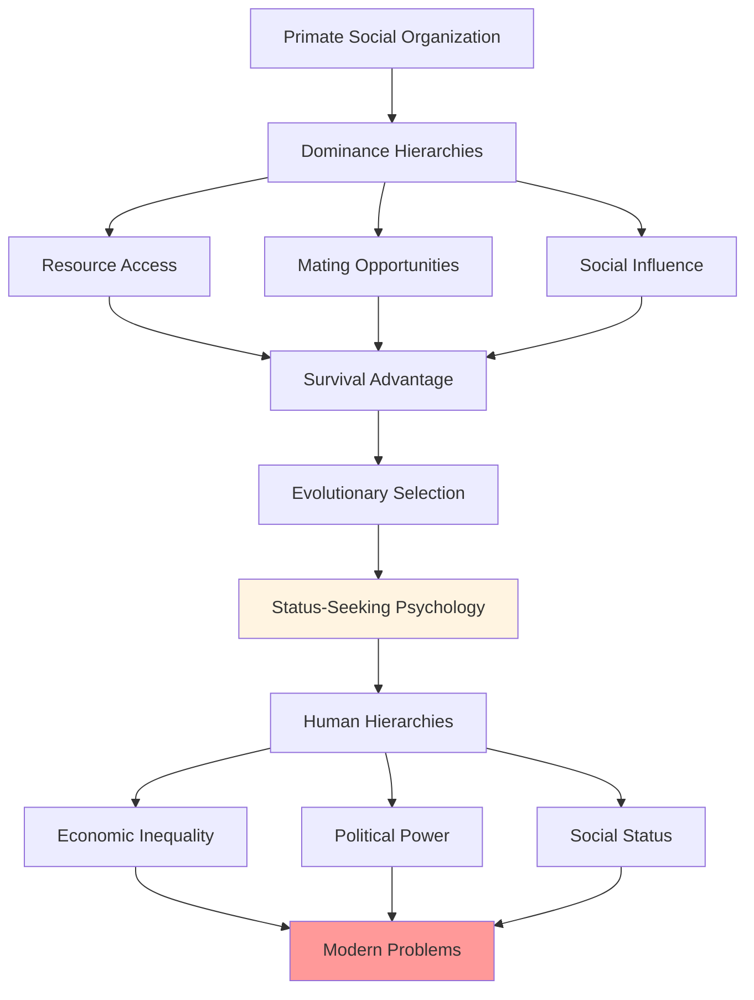
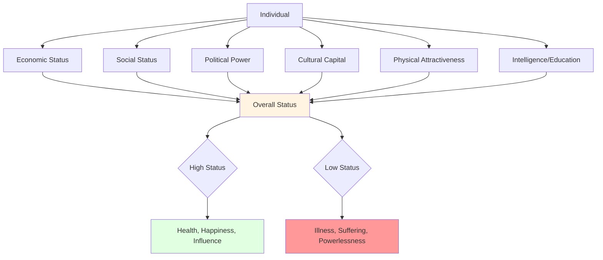
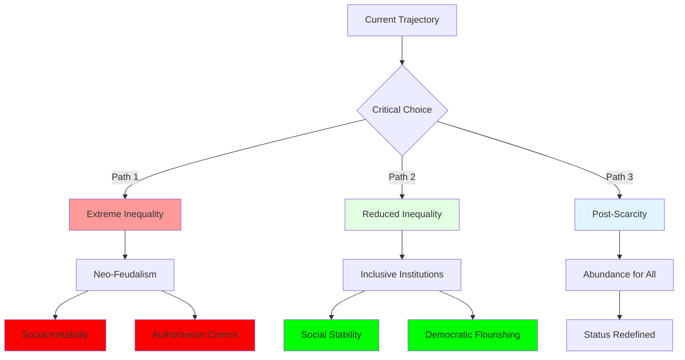

# Social Hierarchies: The Universal Structure of Inequality

## Overview

Social hierarchies—systems of ranked status and power—are universal across human societies. From hunter-gatherer bands to modern nation-states, humans organize themselves into hierarchical structures where some individuals have more status, resources, and influence than others. This universality suggests deep evolutionary and psychological roots.

**The fundamental tension**: Hierarchies serve important functions—coordinating group action, allocating resources, motivating effort—but they also produce inequality, conflict, and suffering. Humans simultaneously crave status and resent hierarchy, compete for dominance while idealizing equality.

Understanding social hierarchies is essential to understanding humanity's problems because hierarchy shapes nearly every aspect of human life: health, happiness, behavior, beliefs, and life outcomes. The position one occupies in various hierarchies—economic, social, political—profoundly affects one's experience of being human.

## Table of Contents

- [The Nature of Hierarchy](#the-nature-of-hierarchy)
- [Types of Hierarchies](#types-of-hierarchies)
- [Status Competition](#status-competition)
- [Hierarchy and Health](#hierarchy-and-health)
- [Legitimation and Ideology](#legitimation-and-ideology)
- [Hierarchy and Violence](#hierarchy-and-violence)
- [Historical Patterns](#historical-patterns)
- [Contemporary Manifestations](#contemporary-manifestations)
- [Future Trajectories](#future-trajectories)
- [Interconnections](#interconnections)

## The Nature of Hierarchy

### Evolutionary Origins

**Diagram Explanation**: Social hierarchies have deep evolutionary roots in primate dominance systems. Higher-ranking individuals gained better access to resources, mating opportunities, and social influence, providing survival and reproductive advantages. This created evolutionary selection for status-seeking psychology. In humans, this manifests as economic, political, and social hierarchies that, while serving some functions, produce modern problems of inequality, conflict, and suffering.

### Functions of Hierarchy

| Function | Mechanism | Benefits | Costs |
|----------|-----------|----------|-------|
| **Coordination** | Clear authority structure | Efficient decision-making, reduced conflict | Suppression of dissent, poor decisions |
| **Resource Allocation** | Differential distribution | Rewards contribution, motivates effort | Inequality, resentment, waste |
| **Conflict Resolution** | Status determines outcomes | Avoids costly fights | Injustice, oppression |
| **Specialization** | Role differentiation | Expertise development, efficiency | Rigidity, limited mobility |
| **Motivation** | Status competition | Drives achievement, innovation | Anxiety, zero-sum thinking |

**Table Explanation**: Hierarchies serve multiple functions that explain their universality. They coordinate group action through clear authority, allocate resources to motivate contribution, resolve conflicts without violence, enable specialization, and motivate achievement through status competition. However, each function comes with significant costs: suppressed dissent, inequality, injustice, rigidity, and anxiety. Understanding this trade-off reveals why hierarchies persist despite their problems.

## Types of Hierarchies

### Dominance vs. Prestige Hierarchies

Two fundamental types of status systems:

**Dominance Hierarchies**:
- Based on force, coercion, intimidation
- Status through fear and submission
- Zero-sum: One's gain is another's loss
- Produces resentment and instability
- Examples: Authoritarian regimes, prison hierarchies, some corporate cultures

**Prestige Hierarchies**:
- Based on respect, admiration, freely conferred deference
- Status through competence and contribution
- Positive-sum: High-status individuals benefit group
- Produces willing cooperation
- Examples: Academic reputation, artistic recognition, expertise-based authority

**Reality**: Most hierarchies combine both elements, with varying ratios.

### Multiple Hierarchy Dimensions

Modern societies have multiple, partially independent hierarchies:

**Diagram Explanation**: Individuals occupy positions in multiple hierarchies—economic, social, political, cultural, physical, intellectual. These combine to produce overall status, which profoundly affects life outcomes. High overall status correlates with better health, greater happiness, and more influence. Low status correlates with illness, suffering, and powerlessness. The multidimensional nature means individuals can be high in some hierarchies and low in others, creating complex status dynamics.

## Status Competition

### The Status Game

Humans are intensely status-conscious:

**Status Seeking Behaviors**:
- Conspicuous consumption (displaying wealth)
- Credential accumulation (degrees, titles)
- Association with high-status individuals
- Competitive achievement
- Dominance displays
- Virtue signaling

**Status Anxiety**:
- Constant social comparison
- Fear of status loss
- Envy of higher-status individuals
- Contempt for lower-status individuals
- Identity tied to relative position

### The Hedonic Treadmill of Status

**Diagram Explanation**: Status satisfaction is temporary. Achieving higher status produces brief satisfaction, but adaptation occurs as individuals compare themselves to new, higher-status reference groups. This produces renewed dissatisfaction and increased status seeking, creating a treadmill where status gains don't produce lasting satisfaction. This mechanism drives perpetual status competition and explains why increasing absolute wealth doesn't increase happiness—relative position matters more.

### Zero-Sum Status Competition

A fundamental problem: Status is inherently relative and zero-sum:
- If everyone moves up, no one moves up
- One person's status gain often requires another's loss
- Competition for positional goods (top university spots, prestigious jobs)
- Arms races in status signaling (credential inflation, consumption escalation)

This creates wasteful competition and prevents collective satisfaction.

## Hierarchy and Health

### The Status Syndrome

Research reveals strong correlations between hierarchical position and health:

| Status Level | Life Expectancy | Chronic Disease | Mental Health | Subjective Well-being |
|--------------|----------------|-----------------|---------------|----------------------|
| **High** | Longest | Lowest rates | Best | Highest |
| **Middle** | Moderate | Moderate rates | Moderate | Moderate |
| **Low** | Shortest | Highest rates | Worst | Lowest |

**Gradient Effect**: Health improves at each step up the hierarchy—not just poverty vs. wealth, but each incremental status increase.

### Mechanisms Linking Status to Health

1. **Material Resources**: Higher status provides better healthcare, nutrition, housing
2. **Stress**: Lower status produces chronic stress, affecting immune and cardiovascular systems
3. **Control**: Higher status provides more autonomy and control, reducing stress
4. **Social Support**: Status affects social network quality
5. **Health Behaviors**: Status influences smoking, exercise, diet
6. **Psychological**: Status affects self-esteem, sense of worth, mental health

**Critical Insight**: Even controlling for material resources, status independently affects health through psychological and social pathways.

## Legitimation and Ideology

### Justifying Inequality

Hierarchies require legitimation—beliefs that justify inequality:

**Legitimating Ideologies**:
- **Meritocracy**: "People get what they deserve based on effort and ability"
- **Divine Right**: "God ordained the social order"
- **Natural Order**: "Hierarchy is natural and inevitable"
- **Social Darwinism**: "Survival of the fittest justifies inequality"
- **Technocracy**: "Experts should rule based on knowledge"

**Functions**:
- Make inequality seem fair and natural
- Reduce resistance from low-status individuals
- Reduce guilt for high-status individuals
- Stabilize social order

### System Justification Theory

People tend to justify existing systems, even when disadvantaged:

**Mechanisms**:
- **Cognitive dissonance**: Believing system is unfair creates psychological discomfort
- **Rationalization**: Constructing explanations for inequality
- **False consciousness**: Adopting beliefs that justify one's own disadvantage
- **Just-world hypothesis**: Believing people get what they deserve

**Consequence**: Even victims of inequality often support systems that disadvantage them.

## Hierarchy and Violence

### Status Threats and Aggression

Much violence stems from status concerns:

**Individual Violence**:
- Honor cultures: Violence to defend reputation
- Gang violence: Status competition
- Domestic violence: Reasserting dominance
- Workplace violence: Response to status loss

**Collective Violence**:
- Wars: National status competition
- Revolutions: Challenging hierarchies
- Ethnic conflict: Group status competition
- Terrorism: Asymmetric status assertion

### The Paradox of Declining Violence

Steven Pinker documents declining violence over history, but:
- Absolute violence has declined
- But status competition and inequality persist
- Violence becomes more organized and systematic
- Structural violence (poverty, inequality) continues

## Historical Patterns

### The Agricultural Revolution and Inequality

Hunter-gatherer societies were relatively egalitarian:
- Limited resource accumulation
- Sharing norms
- Mobility preventing domination

Agriculture enabled inequality:
- Surplus accumulation
- Property ownership
- Hereditary status
- State formation

Result: Dramatic increase in inequality over past 10,000 years.

### Historical Inequality Patterns

| Era | Gini Coefficient | Characteristics | Mechanisms |
|-----|------------------|-----------------|------------|
| **Hunter-Gatherer** | 0.15-0.25 | Relatively equal | Sharing norms, mobility |
| **Agricultural** | 0.35-0.45 | Moderate inequality | Land ownership, heredity |
| **Pre-Industrial** | 0.45-0.55 | High inequality | Aristocracy, serfdom |
| **Industrial** | 0.35-0.50 | Variable | Capitalism, labor movements |
| **Contemporary** | 0.30-0.65 | Highly variable | Varies by policy, institutions |

**Table Explanation**: The Gini coefficient measures inequality (0 = perfect equality, 1 = perfect inequality). Historical patterns show relatively egalitarian hunter-gatherer societies, increasing inequality with agriculture and state formation, peak inequality in pre-industrial aristocratic societies, variable inequality in industrial and contemporary periods depending on institutions and policies.

### The Great Compression and Expansion

20th century inequality patterns:
- **1910s-1940s**: Increasing inequality
- **1940s-1970s**: "Great Compression"—declining inequality in developed nations
- **1980s-present**: "Great Expansion"—rapidly increasing inequality

**Causes of Recent Increase**:
- Globalization
- Technological change
- Declining labor power
- Policy changes (tax cuts, deregulation)
- Winner-take-all markets

## Contemporary Manifestations

### Extreme Wealth Concentration

Current inequality levels:
- Top 1% owns ~40% of wealth in many countries
- Top 0.1% owns ~20%
- Bottom 50% owns ~2%
- Billionaires' wealth exceeds GDP of most nations

**Consequences**:
- Political influence concentrated
- Opportunity inequality
- Social mobility declining
- Democratic legitimacy threatened

### Status Anxiety Epidemic

Modern societies produce intense status anxiety:

**Drivers**:
- Meritocratic ideology (failure is personal)
- Social comparison amplified by media
- Credential inflation
- Winner-take-all markets
- Precarious employment

**Consequences**:
- Mental health crisis
- Overwork and burnout
- Parenting anxiety
- Educational arms races
- Consumption competition

### Digital Status Hierarchies

Social media creates new status systems:
- Follower counts as status metric
- Likes and engagement as validation
- Influencer hierarchies
- Viral fame and instant status
- Cancel culture as status destruction

**Problems**:
- Constant social comparison
- Validation addiction
- Performative identity
- Anxiety and depression
- Distorted values

## Future Trajectories

### Technological Inequality

Emerging technologies may increase inequality:

**AI and Automation**:
- Displacing workers
- Concentrating returns to capital
- Winner-take-all dynamics
- Skill-biased technological change

**Genetic Engineering**:
- Enhanced humans vs. unenhanced
- Hereditary advantages amplified
- New forms of biological hierarchy

**Life Extension**:
- Immortal elites vs. mortal masses
- Compounding advantages over time

### Possible Futures

**Diagram Explanation**: Current inequality trends present critical choices. Path 1 continues extreme inequality toward neo-feudalism, producing social instability and requiring authoritarian control. Path 2 reduces inequality through inclusive institutions, producing social stability and democratic flourishing. Path 3 achieves post-scarcity abundance, requiring redefinition of status beyond material resources. The path chosen will determine humanity's future.

## Interconnections

This problem connects to:

- **[Status Competition](../psychology/identity-formation.md)**: Individual psychology of status seeking
- **[Group Dynamics](./group-dynamics.md)**: Hierarchies within groups
- **[Tribalism](./tribalism.md)**: Status competition between groups
- **[Economic Inequality](../economics/inequality.md)**: Material dimensions of hierarchy
- **[Political Power](../politics/power-dynamics.md)**: Political hierarchies
- **[Historical Patterns](../history/rise-and-fall-civilizations.md)**: Inequality and civilizational collapse
- **[Violence](../history/violence-and-conflict.md)**: Status and aggression

## Related Topics

- [Group Dynamics](./group-dynamics.md)
- [Tribalism](./tribalism.md)
- [Economic Inequality](../economics/inequality.md)
- [Power Dynamics](../politics/power-dynamics.md)

## References

- Marmot, M. (2004). *The Status Syndrome*
- Wilkinson, R., & Pickett, K. (2009). *The Spirit Level*
- Boehm, C. (1999). *Hierarchy in the Forest*
- Piketty, T. (2014). *Capital in the Twenty-First Century*

---

**Navigation**: [← Back to Sociology Index](./INDEX.md) | [Next: Tribalism →](./tribalism.md)
