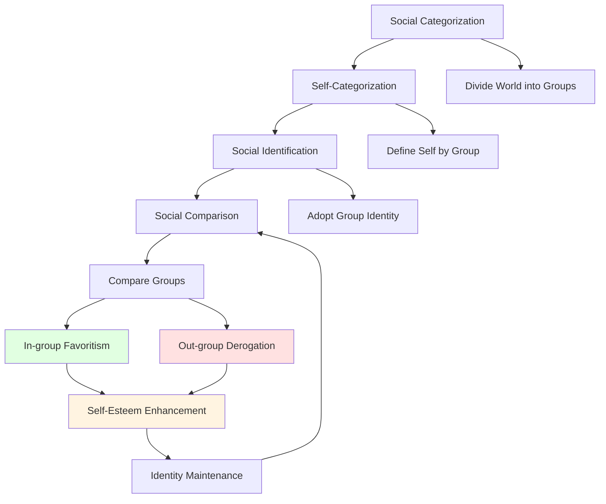

# Social Identity: The Self Through Group Membership

## Overview

Social identity refers to the aspects of self-concept derived from group memberships. Unlike personal identity (individual characteristics), social identity comes from belonging to social categories: nationality, ethnicity, religion, political party, profession, gender, and countless other groups. Henri Tajfel's Social Identity Theory reveals that humans don't just belong to groups—we psychologically become our groups, deriving meaning, self-esteem, and purpose from collective identities.

**The fundamental insight**: Much human behavior cannot be understood as individual psychology but only as group psychology. People don't just join groups; they internalize group identities that shape perception, emotion, and behavior. This makes social identity central to understanding cooperation, conflict, prejudice, and collective action.

**The problem**: Social identity enables cooperation within groups but fuels conflict between groups. The same process that creates solidarity and meaning also produces tribalism, prejudice, and violence.

## Social Identity Theory

### Core Processes

**Diagram Explanation**: Social identity formation involves four processes. Social categorization divides the world into groups. Self-categorization defines the self by group membership. Social identification involves adopting group identity. Social comparison evaluates one's group relative to others. This produces in-group favoritism and out-group derogation, which enhance self-esteem. The need to maintain positive identity perpetuates the cycle.

## Multiple Identities

Individuals hold multiple social identities simultaneously:

| Identity Type | Examples | Salience Factors | Conflict Potential |
|---------------|----------|------------------|-------------------|
| **Demographic** | Age, gender, race | Visible, ascribed | High |
| **National** | Citizenship, ethnicity | Political context | Very High |
| **Religious** | Faith tradition | Religious context | Very High |
| **Political** | Party, ideology | Political events | High |
| **Professional** | Occupation, role | Work context | Moderate |
| **Lifestyle** | Hobbies, subcultures | Social context | Low |

**Identity Salience**: Which identity is active depends on context. The same person might identify as American (vs. foreigners), Texan (vs. other Americans), conservative (vs. liberals), Christian (vs. other religions), depending on situation.

## Identity and Behavior

### Identity-Protective Cognition

People process information to protect group identity:

**Mechanisms**:
- Accepting information supporting group
- Rejecting information threatening group
- Motivated reasoning to defend group
- Selective exposure to pro-group information
- Hostile attribution toward out-groups

**Consequence**: Facts matter less than identity. People reject overwhelming evidence if it threatens group identity.

### Collective Behavior

Social identity transforms individual into group member:

**Changes**:
- Self-stereotyping: Adopting group characteristics
- Depersonalization: Seeing self as interchangeable group member
- Conformity: Aligning with group norms
- Collective action: Acting for group interests
- Emotional contagion: Sharing group emotions

## Historical Patterns

### Nationalism

National identity as powerful social identity:
- Millions willing to die for nation
- Wars fought over national identity
- Ethnic cleansing to create homogeneous nations
- Immigration conflicts over national identity

### Religious Identity

Religious identity historically central:
- Crusades, jihads, religious wars
- Persecution of religious out-groups
- Identity-based violence
- Contemporary religious conflicts

## Contemporary Manifestations

### Political Identity

Modern politics increasingly identity-based:

**Affective Polarization**: Emotional response to party identity exceeds policy disagreement

**Indicators**:
- Party as identity marker
- Unwillingness to socialize across party lines
- Viewing opponents as immoral
- Celebrating harm to other party
- Rejecting facts from out-party sources

### Identity Politics

Contemporary focus on group identities:

**Positive Aspects**:
- Recognition of marginalized groups
- Challenging dominant group privilege
- Empowerment through collective identity

**Challenges**:
- Fragmentation into competing identities
- Oppression Olympics
- Difficulty finding common ground
- Essentialism and stereotyping

## Interconnections

This problem connects to:

- **[Identity Formation](../psychology/identity-formation.md)**: Individual identity processes
- **[Tribalism](./tribalism.md)**: In-group/out-group dynamics
- **[Group Dynamics](./group-dynamics.md)**: Group processes
- **[Political Polarization](../politics/power-dynamics.md)**: Political identity
- **[Religious Conflict](../religion-philosophy/religious-conflict.md)**: Religious identity

## Related Topics

- [Identity Formation](../psychology/identity-formation.md)
- [Tribalism](./tribalism.md)
- [Group Dynamics](./group-dynamics.md)

---

**Navigation**: [← Back to Sociology Index](./INDEX.md) | [Next Category: Anthropology →](../anthropology/INDEX.md)
