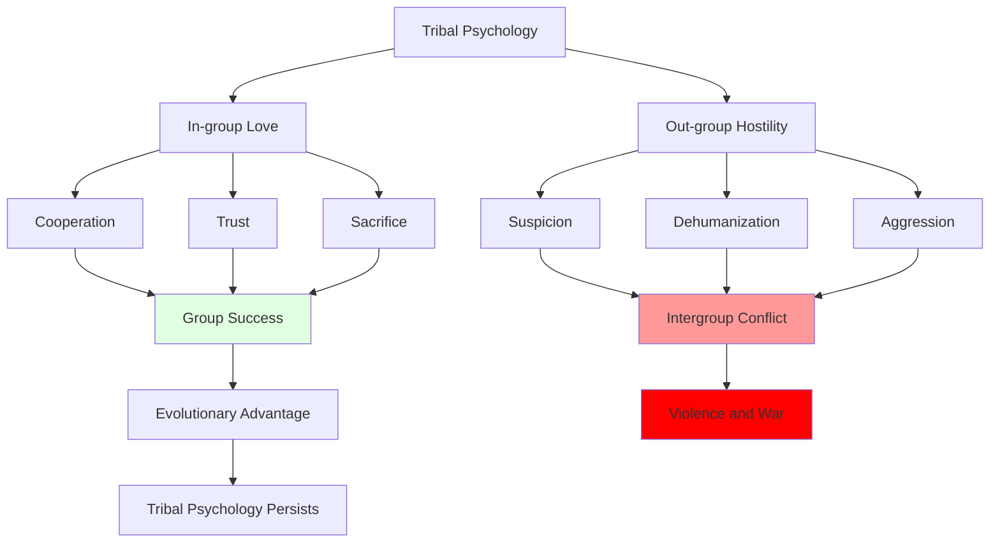

# Tribalism: The Psychology of Us vs. Them

## Overview

Tribalism—the tendency to form in-groups and view out-groups with suspicion or hostility—is one of humanity's most powerful and problematic psychological tendencies. Humans are tribal animals who evolved in small groups where cooperation with in-group members and wariness of out-group members provided survival advantages. This tribal psychology now operates in contexts far removed from ancestral environments, producing conflict, prejudice, and inability to cooperate at scale.

**The core problem**: The same psychological mechanisms that enable human cooperation within groups also fuel conflict between groups. We are simultaneously the most cooperative and most warlike species. Tribalism makes us capable of extraordinary sacrifice for group members while enabling dehumanization and violence toward outsiders.

Understanding tribalism is essential because it underlies many of humanity's most intractable problems: war, ethnic conflict, political polarization, racism, nationalism, and religious violence. Until we understand our tribal nature, we cannot address these challenges effectively.

## The Tribal Mind

### Minimal Group Paradigm

Henri Tajfel's experiments revealed how easily tribalism emerges:

**Procedure**: Assign people to arbitrary groups (coin flip, preference for paintings)

**Results**:
- Immediate in-group favoritism
- Out-group discrimination
- Group-based identity formation
- Willingness to sacrifice personal gain to benefit in-group relative to out-group

**Implication**: Tribalism requires minimal provocation—even meaningless distinctions trigger us-vs-them psychology.

### Components of Tribal Psychology

| Component | Description | Function | Problem |
|-----------|-------------|----------|---------|
| **In-group Favoritism** | Preferring and helping group members | Cooperation, mutual aid | Discrimination, nepotism |
| **Out-group Derogation** | Devaluing and harming non-members | Resource competition, defense | Prejudice, violence |
| **Group Identity** | Defining self through group membership | Belonging, meaning | Loss of individuality |
| **Conformity Pressure** | Enforcing group norms | Coordination, cohesion | Suppression of dissent |
| **Moral Tribalism** | Viewing in-group as moral, out-group as immoral | Justifying behavior | Moral blindness |

## Mechanisms of Tribalism

**Diagram Explanation**: Tribal psychology produces both in-group love and out-group hostility. In-group love generates cooperation, trust, and sacrifice, leading to group success and evolutionary advantage. Out-group hostility produces suspicion, dehumanization, and aggression, leading to intergroup conflict and violence. Both aspects were adaptive in ancestral environments, causing tribal psychology to persist despite its destructive modern consequences.

## Historical Manifestations

### Ethnic Cleansing and Genocide

Tribalism enables the worst human atrocities:

- **Holocaust**: Jewish out-group dehumanization
- **Rwanda**: Hutu-Tutsi tribal violence
- **Yugoslavia**: Ethnic nationalism
- **Myanmar**: Rohingya persecution

Common pattern: Dehumanizing rhetoric → segregation → violence → genocide

### Nationalism and War

National identity as tribal identity:
- World Wars driven by national tribalism
- Millions willing to die for national groups
- "My country right or wrong" mentality
- Inability to cooperate internationally

## Contemporary Tribalism

### Political Polarization

Modern politics as tribal warfare:

**Affective Polarization**: Emotional hatred of other party exceeds policy disagreement

**Tribal Indicators**:
- Party as identity, not policy preference
- Viewing opponents as evil, not mistaken
- Rejecting facts that threaten group beliefs
- Celebrating harm to out-group
- Unwillingness to socialize across party lines

### Social Media Tribalism

Digital platforms amplify tribal dynamics:
- Algorithm-driven echo chambers
- Outrage content drives engagement
- Viral shaming and mob behavior
- Cancel culture as tribal punishment
- Filter bubbles preventing cross-group contact

## Interconnections

This problem connects to:

- **[In-group Bias](../psychology/cognitive-biases.md)**: Cognitive basis of tribalism
- **[Identity Formation](../psychology/identity-formation.md)**: Group identity
- **[Group Dynamics](./group-dynamics.md)**: In-group processes
- **[Social Hierarchies](./social-hierarchies.md)**: Status competition between groups
- **[Religious Conflict](../religion-philosophy/religious-conflict.md)**: Religious tribalism
- **[Political Polarization](../politics/power-dynamics.md)**: Political tribalism
- **[Violence and Conflict](../history/violence-and-conflict.md)**: Tribal violence

## Related Topics

- [Group Dynamics](./group-dynamics.md)
- [Social Identity](./social-identity.md)
- [Social Hierarchies](./social-hierarchies.md)

---

**Navigation**: [← Back to Sociology Index](./INDEX.md) | [Next: Collective Action Problems →](./collective-action-problems.md)
