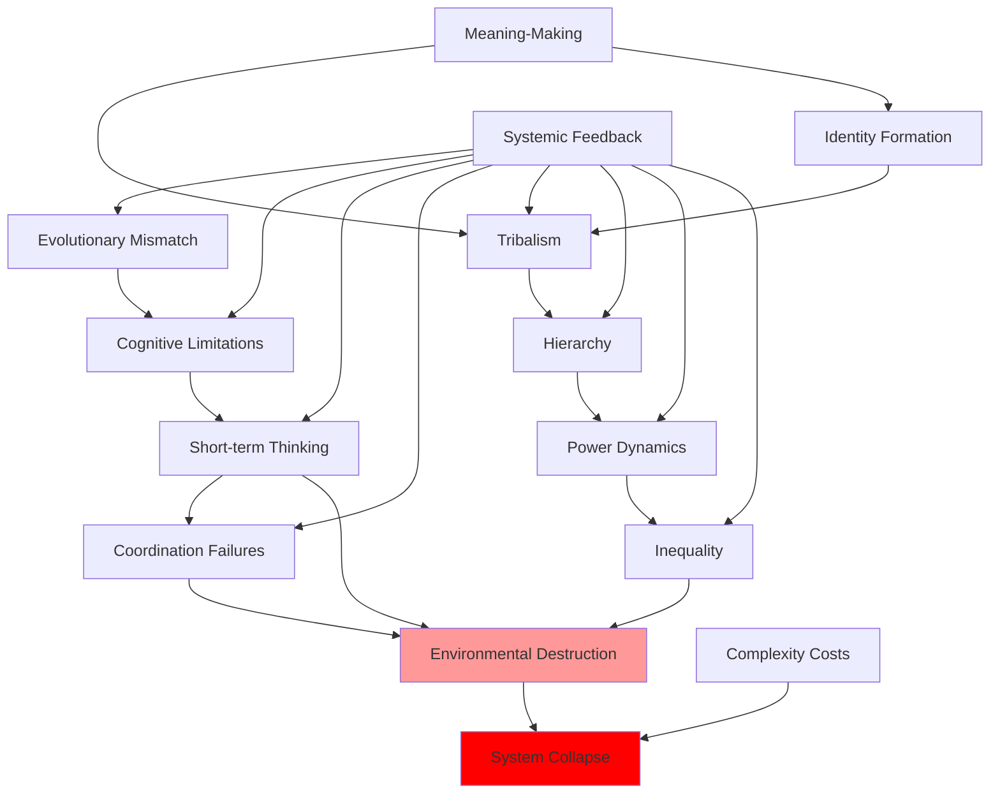

# Fundamental Patterns: Core Dynamics Across All Domains

## Overview

Certain patterns appear repeatedly across psychology, sociology, history, economics, politics, and all other domains. These fundamental patterns reveal the deep structure of humanity's problems—the underlying dynamics that produce diverse surface manifestations.

## The Ten Fundamental Patterns

### 1. Evolutionary Mismatch

**Pattern**: Human psychology evolved for ancestral environments but operates in radically different modern contexts

**Manifestations**:
- Cognitive biases (psychology)
- Dietary problems (health)
- Tribal conflict (sociology)
- Short-term thinking (economics)
- Environmental destruction (environment)

### 2. Cognitive Limitations

**Pattern**: Systematic constraints on human reasoning and decision-making

**Manifestations**:
- Biases and heuristics (psychology)
- Groupthink (sociology)
- Historical amnesia (history)
- Market failures (economics)
- Democratic dysfunction (politics)

### 3. Coordination Failures

**Pattern**: Individual rationality producing collective irrationality

**Manifestations**:
- Prisoner's dilemma (game theory)
- Tragedy of commons (economics)
- Collective action problems (sociology)
- Climate change (environment)
- Arms races (politics)

### 4. Short-term Thinking

**Pattern**: Systematic discounting of future consequences

**Manifestations**:
- Present bias (psychology)
- Temporal discounting (economics)
- Political myopia (politics)
- Environmental degradation (environment)
- Civilizational collapse (history)

### 5. Tribalism

**Pattern**: In-group favoritism and out-group hostility

**Manifestations**:
- In-group bias (psychology)
- Group dynamics (sociology)
- Ethnic conflict (history)
- Political polarization (politics)
- Religious violence (religion)

### 6. Hierarchy and Inequality

**Pattern**: Universal status systems producing stratification

**Manifestations**:
- Status seeking (psychology)
- Social hierarchies (sociology)
- Economic inequality (economics)
- Power dynamics (politics)
- Historical patterns (history)

### 7. Complexity Costs

**Pattern**: Increasing complexity eventually produces diminishing or negative returns

**Manifestations**:
- Cognitive overload (psychology)
- Organizational dysfunction (sociology)
- Civilizational collapse (history)
- Regulatory burden (economics)
- Governance failures (politics)

### 8. Meaning-Making Imperative

**Pattern**: Humans require meaning and purpose to function

**Manifestations**:
- Existential needs (psychology)
- Religious belief (religion)
- Identity formation (psychology)
- Ideological commitment (politics)
- Cultural narratives (anthropology)

### 9. Power Dynamics

**Pattern**: Universal seeking and abuse of power

**Manifestations**:
- Dominance hierarchies (psychology)
- Social stratification (sociology)
- Historical conflicts (history)
- Political corruption (politics)
- Economic concentration (economics)

### 10. Systemic Feedback

**Pattern**: Self-reinforcing cycles amplifying problems

**Manifestations**:
- Confirmation bias loops (psychology)
- Polarization spirals (sociology)
- Historical cycles (history)
- Economic bubbles (economics)
- Climate feedback loops (environment)

## Pattern Interactions

**Diagram Explanation**: Fundamental patterns interact and reinforce each other. Evolutionary mismatch produces cognitive limitations, which cause short-term thinking, leading to coordination failures. Tribalism connects to hierarchy and power dynamics, producing inequality. Meaning-making drives identity formation and tribalism. These patterns combine to produce environmental destruction and potential system collapse. Systemic feedback amplifies all patterns, creating self-reinforcing cycles.

## Implications

### Why Problems Persist

These patterns explain why humanity's problems are so intractable:
- Rooted in human nature (evolutionary, cognitive)
- Self-reinforcing (feedback loops)
- Interconnected (solving one affects others)
- Resistant to simple solutions

### Potential Interventions

Understanding patterns suggests intervention points:
- **Institutional design**: Counteract biases and coordination failures
- **Education**: Increase awareness of patterns
- **Cultural evolution**: Develop adaptive norms
- **Technology**: Tools to extend cognitive limits
- **Systems thinking**: Address interconnections

### Limitations

Even understanding patterns doesn't guarantee solutions:
- Patterns reflect deep constraints
- Interventions face same patterns
- Unintended consequences likely
- Coordination still difficult

## Interconnections

This synthesis connects to all domains:
- [Psychology](../psychology/INDEX.md)
- [Sociology](../sociology/INDEX.md)
- [History](../history/INDEX.md)
- [Economics](../economics/INDEX.md)
- [Politics](../politics/INDEX.md)
- [Environment](../environment/INDEX.md)
- [Technology](../technology/INDEX.md)

## Related Topics

- [Systemic Interconnections](./systemic-interconnections.md)
- [Future Trajectories](./future-trajectories.md)
- [Interconnections Map](../INTERCONNECTIONS.md)

---

**Navigation**: [← Back to Synthesis Index](./INDEX.md) | [Next: Systemic Interconnections →](./systemic-interconnections.md)
