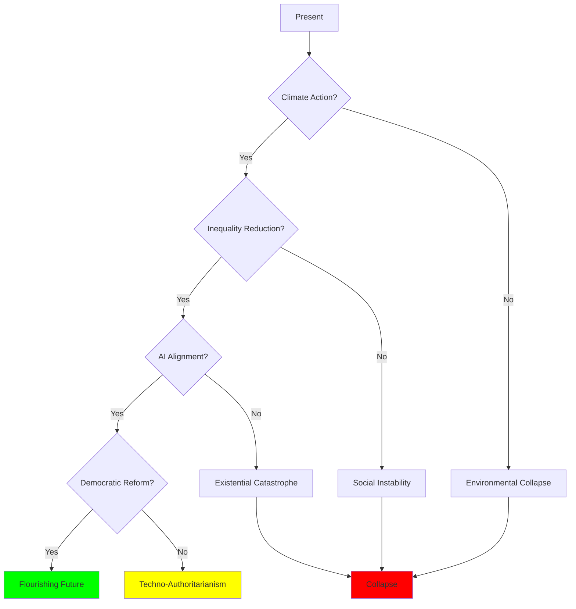

# Future Trajectories: Potential Futures and Critical Choices

## Overview

Current trends point toward multiple possible futures for humanity. Understanding these trajectories—from catastrophic collapse to flourishing—helps identify critical choice points and potential interventions. The future is not predetermined but shaped by choices made today.

## Possible Futures

### Trajectory 1: Catastrophic Collapse

**Drivers**:
- Climate change accelerates
- Resource depletion continues
- Inequality increases
- Political dysfunction worsens
- Technological risks materialize

**Scenario**:
- Environmental tipping points crossed
- Mass migration and conflict
- Democratic collapse
- Authoritarian responses
- Civilizational breakdown

**Probability**: Moderate and increasing without intervention

### Trajectory 2: Muddling Through

**Drivers**:
- Incremental progress on some problems
- Continued dysfunction on others
- Technological solutions partially effective
- Institutions adapt slowly
- Crises managed but not prevented

**Scenario**:
- Ongoing environmental degradation
- Persistent inequality
- Political instability
- Technological disruption
- Gradual decline in quality of life

**Probability**: High—current default trajectory

### Trajectory 3: Technological Salvation

**Drivers**:
- Rapid technological advancement
- AI solves complex problems
- Clean energy transition
- Abundance through automation
- Space expansion

**Scenario**:
- Climate stabilized through technology
- Post-scarcity economy
- Extended lifespans
- Enhanced human capabilities
- Expansion beyond Earth

**Probability**: Low—requires breakthroughs and avoiding risks

**Risks**: AI alignment failure, inequality amplification, loss of meaning

### Trajectory 4: Coordinated Transformation

**Drivers**:
- Global cooperation increases
- Institutions reformed
- Values shift toward sustainability
- Inequality reduced
- Long-term thinking adopted

**Scenario**:
- Climate action succeeds
- Sustainable economy
- Inclusive institutions
- Reduced conflict
- Human flourishing

**Probability**: Low—requires unprecedented coordination

**Challenges**: Overcoming coordination failures, vested interests, short-term thinking

## Critical Choice Points

**Diagram Explanation**: The future depends on critical choices at key decision points. Climate action is the first critical choice—failure leads to environmental collapse. If climate action succeeds, inequality reduction becomes critical—failure produces social instability. AI alignment is next—failure risks existential catastrophe. Finally, democratic reform determines whether we achieve flourishing or techno-authoritarianism. Multiple paths lead to collapse; only one narrow path leads to flourishing.

## Time Horizons

### Near-term (2025-2035)

**Critical Issues**:
- Climate tipping points
- AI development
- Political polarization
- Inequality trends
- Pandemic preparedness

**Key Decisions**:
- Emissions reductions
- AI governance
- Democratic reforms
- Inequality policies
- International cooperation

### Medium-term (2035-2065)

**Critical Issues**:
- Climate impacts
- Automation effects
- Resource scarcity
- Demographic shifts
- Technological transformation

**Key Decisions**:
- Adaptation strategies
- Economic restructuring
- Migration policies
- Technological governance
- Social safety nets

### Long-term (2065-2125)

**Critical Issues**:
- Civilizational sustainability
- Human enhancement
- Space expansion
- Artificial general intelligence
- Existential risks

**Key Decisions**:
- Long-term institutions
- Human identity
- Relationship with AI
- Cosmic expansion
- Existential risk management

## Factors Determining Trajectory

### Technological

- AI development path
- Clean energy transition
- Biotechnology advances
- Space capabilities
- Geoengineering

### Economic

- Inequality trends
- Growth vs. sustainability
- Automation impacts
- Resource availability
- Economic systems

### Political

- Democratic resilience
- International cooperation
- Institutional adaptation
- Governance quality
- Conflict management

### Social

- Value shifts
- Social cohesion
- Education quality
- Cultural evolution
- Collective action capacity

### Environmental

- Climate change pace
- Tipping points
- Biodiversity loss
- Resource depletion
- Ecosystem resilience

## Interventions

### High-Leverage Interventions

1. **Climate action**: Prevent catastrophic warming
2. **AI alignment**: Ensure beneficial AI
3. **Inequality reduction**: Maintain social cohesion
4. **Democratic reform**: Improve governance
5. **Education**: Increase collective intelligence
6. **International cooperation**: Enable coordination
7. **Long-term institutions**: Represent future generations
8. **Value shifts**: Promote sustainability, cooperation
9. **Technological governance**: Manage risks
10. **Systems thinking**: Understand interconnections

### Barriers to Intervention

- Short-term thinking
- Vested interests
- Coordination failures
- Political dysfunction
- Cognitive limitations
- Cultural inertia
- Complexity
- Uncertainty

## Conclusion

The future is not predetermined. Current trajectories point toward crisis, but alternative paths exist. The critical question is whether humanity can overcome its inherent limitations—cognitive biases, coordination failures, short-term thinking, tribalism—to navigate toward flourishing rather than collapse.

**The choice is ours. The time is now.**

## Interconnections

This synthesis connects to:
- [Fundamental Patterns](./fundamental-patterns.md)
- [Systemic Interconnections](./systemic-interconnections.md)
- [All Domain Categories](../README.md)

## Related Topics

- [Fundamental Patterns](./fundamental-patterns.md)
- [Systemic Interconnections](./systemic-interconnections.md)
- [Climate Psychology](../environment/climate-psychology.md)
- [AI and Automation](../technology/ai-and-automation.md)

---

**Navigation**: [← Back to Synthesis Index](./INDEX.md) | [Return to Main Index](../README.md)
