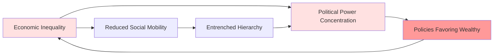
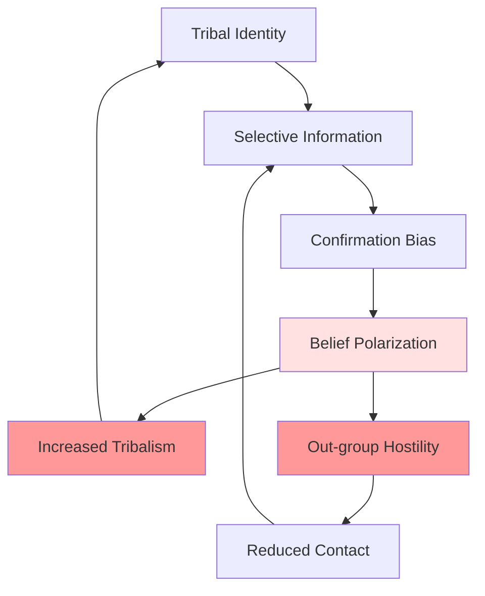

# Systemic Interconnections: How Problems Connect and Reinforce

## Overview

Humanity's problems don't exist in isolation—they form interconnected systems with feedback loops, emergent properties, and cascading effects. Understanding these systemic relationships reveals why problems are so difficult to solve: addressing one problem often affects others, sometimes making them worse.

## Major Feedback Loops

### The Inequality-Power Loop

**Explanation**: Economic inequality produces political power concentration. Wealthy individuals and corporations influence policy to favor their interests, increasing inequality further. Reduced social mobility entrenches hierarchies, reinforcing power concentration. This self-reinforcing loop is extremely difficult to break.

### The Polarization Spiral

**Explanation**: Tribal identity drives selective information consumption. Confirmation bias reinforces existing beliefs, producing polarization. This increases tribalism and out-group hostility, reducing cross-group contact and further limiting information exposure. The spiral intensifies over time.

### The Environmental Degradation Cycle

**Explanation**: Resource exploitation damages environment, creating scarcity. Scarcity increases competition and conflict, weakening institutions that could regulate exploitation. Climate change disrupts agriculture, worsening scarcity. The cycle accelerates environmental collapse.

## Cross-Domain Connections

### Psychology → Sociology → Politics

Individual cognitive biases aggregate into group phenomena (groupthink, polarization), which shape political behavior (tribal voting, democratic dysfunction).

### Economics → Environment → Society

Economic incentives drive environmental destruction, which produces resource scarcity, increasing inequality and conflict.

### Technology → Psychology → Society

Technology exploits psychological vulnerabilities (attention, social validation), producing individual dysfunction (addiction, anxiety) and social problems (polarization, misinformation).

## Emergent Properties

### System-Level Phenomena

Some problems exist only at system level:
- **Financial crises**: Emerge from interactions, not individual decisions
- **Political polarization**: Group phenomenon, not individual extremism
- **Climate change**: Collective outcome of individual actions
- **Civilizational collapse**: System failure, not individual failure

### Cascading Failures

Problems in one domain cascade to others:
- Economic crisis → political instability → social unrest → violence
- Environmental degradation → resource scarcity → migration → conflict
- Technological disruption → unemployment → inequality → political extremism

## Why Problems Are Intractable

### Interconnection

- Solving one problem affects others
- Unintended consequences common
- Partial solutions insufficient
- Requires coordinated action

### Feedback Loops

- Self-reinforcing dynamics
- Momentum difficult to reverse
- Tipping points and non-linearity
- Delayed effects obscure causation

### Complexity

- Too many variables to model
- Emergent properties unpredictable
- Interventions have unexpected effects
- System behavior counterintuitive

### Scale

- Global problems require global coordination
- Local actions insufficient
- Coordination failures at scale
- Free-rider problems

## Intervention Strategies

### Leverage Points

Donella Meadows identified leverage points in systems:
1. **Constants, parameters**: Weak leverage
2. **Buffers**: Moderate leverage
3. **Stock-and-flow structures**: Moderate leverage
4. **Delays**: Moderate leverage
5. **Balancing feedback loops**: Moderate leverage
6. **Reinforcing feedback loops**: Strong leverage
7. **Information flows**: Strong leverage
8. **Rules**: Strong leverage
9. **Self-organization**: Very strong leverage
10. **Goals**: Very strong leverage
11. **Paradigms**: Very strong leverage
12. **Transcending paradigms**: Strongest leverage

**Implication**: Most interventions target weak leverage points (parameters, buffers). Effective change requires targeting strong leverage points (feedback loops, rules, paradigms).

### Systems Thinking

Effective intervention requires:
- Understanding interconnections
- Identifying feedback loops
- Anticipating unintended consequences
- Targeting leverage points
- Coordinating across domains
- Long-term perspective

## Interconnections

This synthesis connects to:
- [Fundamental Patterns](./fundamental-patterns.md)
- [Future Trajectories](./future-trajectories.md)
- [All Domain Categories](../README.md)

## Related Topics

- [Fundamental Patterns](./fundamental-patterns.md)
- [Future Trajectories](./future-trajectories.md)
- [Interconnections Map](../INTERCONNECTIONS.md)

---

**Navigation**: [← Back to Synthesis Index](./INDEX.md) | [Next: Future Trajectories →](./future-trajectories.md)
